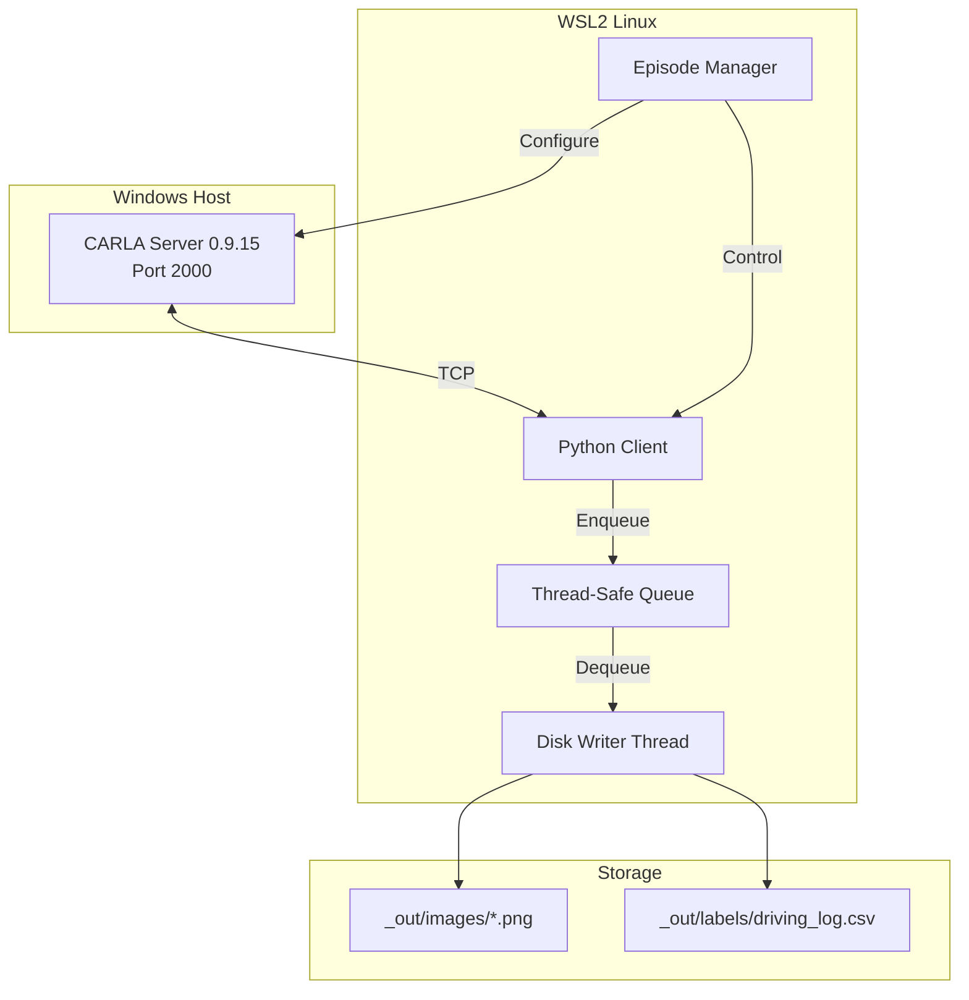
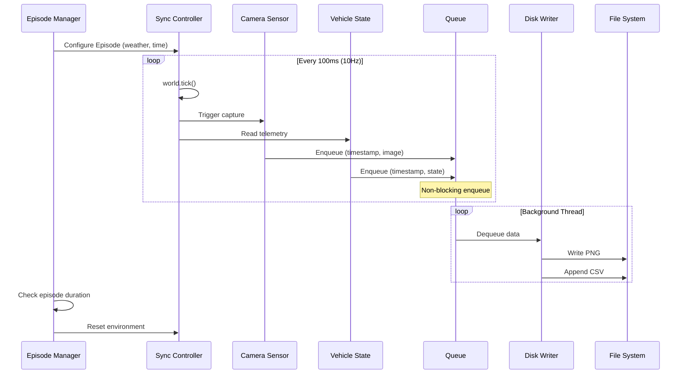

# Design Document

## Overview

The Data Pipeline system is a synchronized multi-modal data collection framework for autonomous driving machine learning. It captures multi-camera images (Front RGB + 4 AVM cameras) paired with vehicle state telemetry from the CARLA simulator at 10Hz, generating high-quality training datasets with diverse edge-case scenarios.

The system operates across a Windows Host (CARLA 0.9.15 Server) and WSL2 Linux (Python Client) boundary, utilizing high-performance NVIDIA RTX 3090 Ti / 4090 GPUs. The design prioritizes three critical objectives:

1. **Zero Frame Drop**: Asynchronous I/O architecture ensures no data loss during 1-hour collection sessions
2. **Perfect Synchronization**: Synchronous mode enforcement guarantees temporal alignment across all 5 cameras and vehicle state
3. **Data Diversity**: Episode-based scenario management generates varied weather and lighting conditions

The camera configuration:
- Front RGB (800×600, FOV 90°): Primary input for BC/RL driving control models
- AVM Front/Rear/Left/Right (400×300, FOV 120°): Wide-angle downward-facing cameras for BEV stitching

The architecture separates concerns into three primary subsystems: Synchronous Mode Controller (tick-based simulation control), Asynchronous Data Logger (thread-safe I/O queue), and Episode Manager (scenario variation orchestration).

## Architecture

### System Context



### Component Architecture

The system follows a Producer-Consumer pattern with three core components:

**1. Synchronous Mode Controller**
- Enforces deterministic simulation stepping via `world.tick()`
- Advances simulator time by exactly 0.1 seconds (10Hz) per tick
- Freezes screen and vehicle state during data capture
- Ensures perfect temporal alignment between camera and telemetry

**2. Asynchronous Data Logger**
- Producer thread: Receives sensor callbacks, enqueues data immediately
- Consumer thread: Dequeues data, performs disk I/O operations
- Thread-safe queue: Decouples capture from storage
- Zero-copy optimization: Minimal memory overhead per frame

**3. Episode Manager**
- Resets environment at configurable intervals (default: 5 minutes)
- Randomizes weather conditions (clear, rain, fog)
- Randomizes time of day (daytime, night, backlight)
- Manages scenario diversity for training data quality

### Data Flow



## Components and Interfaces

### 1. SynchronousModeController

**Responsibility**: Enforce deterministic simulation stepping and coordinate data capture timing.

**Interface**:
```python
class SynchronousModeController:
    def __init__(self, world: carla.World, tick_rate_hz: float = 10.0):
        """
        Initialize synchronous mode controller.
        
        Args:
            world: CARLA world instance
            tick_rate_hz: Simulation frequency (default 10Hz)
        """
        pass
    
    def enable_synchronous_mode(self) -> None:
        """
        Configure CARLA world for synchronous mode.
        Sets fixed_delta_seconds = 1.0 / tick_rate_hz.
        """
        pass
    
    def tick(self) -> int:
        """
        Advance simulation by one time step.
        
        Returns:
            frame_id: Unique frame identifier from CARLA
        """
        pass
    
    def get_timestamp_ms(self) -> int:
        """
        Get current simulation timestamp in milliseconds.
        
        Returns:
            Millisecond-precision timestamp
        """
        pass
```

**Key Design Decisions**:
- Fixed delta time of 0.1 seconds ensures consistent 10Hz operation
- Synchronous mode prevents server from running ahead of client
- Timestamp derived from simulation time (not wall clock) for reproducibility

### 2. AsyncDataLogger

**Responsibility**: Decouple sensor data capture from disk I/O using thread-safe queue.

**Interface**:
```python
from queue import Queue
from threading import Thread
from concurrent.futures import ThreadPoolExecutor
from typing import Tuple
import numpy as np

class AsyncDataLogger:
    def __init__(self, output_dir: str, queue_size: int = 1000, 
                 num_workers: int = 2, png_compression: int = 3):
        """
        Initialize asynchronous data logger.
        
        Args:
            output_dir: Base session directory (e.g., src/data/2026-03-17_143000/)
            queue_size: Maximum queue capacity (default 1000 frames)
            num_workers: Number of I/O worker threads (default 2)
            png_compression: PNG compression level 0-9 (default 3, lower=faster)
            
        Creates subdirectories: front/, avm_front/, avm_rear/, avm_left/, avm_right/, bev/, labels/
        """
        pass
    
    def start(self) -> None:
        """Start background writer thread pool."""
        pass
    
    def enqueue_frame(self, timestamp_ms: int, image: np.ndarray, 
                      vehicle_state: VehicleState) -> None:
        """
        Non-blocking enqueue of captured frame data.
        
        Args:
            timestamp_ms: Millisecond timestamp
            image: Front RGB image array (800x600x3)
            vehicle_state: Vehicle telemetry data
            
        Note: For multi-camera support, this method accepts the front image.
              AVM images are enqueued via enqueue_avm_frame() separately.
        """
        pass
    
    def enqueue_avm_frame(self, timestamp_ms: int, 
                          avm_front: np.ndarray, avm_rear: np.ndarray,
                          avm_left: np.ndarray, avm_right: np.ndarray) -> None:
        """
        Non-blocking enqueue of AVM camera frame data.
        
        Args:
            timestamp_ms: Millisecond timestamp (must match front image)
            avm_front: AVM front image array (300x400x3)
            avm_rear: AVM rear image array (300x400x3)
            avm_left: AVM left image array (300x400x3)
            avm_right: AVM right image array (300x400x3)
        """
        pass
    
    def stop(self) -> None:
        """Stop writer threads and flush remaining queue."""
        pass
    
    def _writer_loop(self) -> None:
        """Background thread: dequeue and write to disk."""
        pass
```

**Key Design Decisions**:
- `queue.Queue` provides thread-safe FIFO operations
- Producer (sensor callback) performs minimal work: enqueue and return
- Consumer uses ThreadPoolExecutor with 2 workers to parallelize I/O operations
- PNG compression level set to 3 (balanced speed/size) to prevent encoding bottleneck
- Queue size of 1000 provides ~100 seconds of buffer at 10Hz (~1.4GB RAM)
- Memory overhead: 800x600x3 uncompressed = 1.44MB per frame, safe for RTX 3090/4090
- Graceful shutdown: flush queue before thread termination

### 3. EpisodeManager

**Responsibility**: Orchestrate scenario variation and environment resets for data diversity.

**Interface**:
```python
from enum import Enum
from typing import List

class WeatherPreset(Enum):
    CLEAR = "ClearNoon"
    RAIN = "WetCloudyNoon"
    FOG = "SoftRainSunset"

class TimeOfDay(Enum):
    DAYTIME = 0.0    # Sun angle 0 degrees
    NIGHT = 180.0    # Sun angle 180 degrees
    BACKLIGHT = 90.0 # Sun angle 90 degrees

class EpisodeManager:
    def __init__(self, world: carla.World, episode_duration_sec: float = 300.0):
        """
        Initialize episode manager.
        
        Args:
            world: CARLA world instance
            episode_duration_sec: Duration per episode (default 5 minutes)
        """
        pass
    
    def start_new_episode(self) -> None:
        """
        Reset environment and apply random scenario configuration.
        - Randomize weather preset
        - Randomize time of day
        - Reset vehicle position (optional)
        """
        pass
    
    def should_reset_episode(self, elapsed_time_sec: float) -> bool:
        """
        Check if episode duration has elapsed.
        
        Args:
            elapsed_time_sec: Time since episode start
            
        Returns:
            True if episode should be reset
        """
        pass
    
    def apply_weather(self, preset: WeatherPreset) -> None:
        """Apply weather configuration to CARLA world."""
        pass
    
    def apply_time_of_day(self, time: TimeOfDay) -> None:
        """Apply sun angle configuration to CARLA world."""
        pass
```

**Key Design Decisions**:
- Episode duration of 5 minutes balances diversity vs. continuity
- Random selection from predefined presets ensures coverage
- Weather and time of day are independent variables
- Episode reset does NOT interrupt data collection (seamless transition)

### 4. VehicleState

**Responsibility**: Data structure for vehicle telemetry.

**Interface**:
```python
from dataclasses import dataclass

@dataclass
class VehicleState:
    speed: float      # m/s
    steering: float   # [-1.0, 1.0]
    throttle: float   # [0.0, 1.0]
    brake: float      # [0.0, 1.0]
```

### 5. DataPipeline (Main Orchestrator)

**Responsibility**: Coordinate all subsystems and manage collection lifecycle.

**Interface**:
```python
class DataPipeline:
    def __init__(self, carla_host: str = "localhost", carla_port: int = 2000,
                 output_dir: str = "src/data", headless: bool = True):
        """
        Initialize data pipeline.
        
        Args:
            carla_host: CARLA server hostname
            carla_port: CARLA server port (default 2000)
            output_dir: Base output directory (session subdir auto-created)
            headless: Run without graphical display
        """
        pass
    
    def connect(self) -> None:
        """Establish TCP connection to CARLA server."""
        pass
    
    def setup_sensors(self) -> None:
        """Attach 5 cameras (front RGB + 4 AVM) to ego vehicle."""
        pass
    
    def run(self, duration_sec: float = 3600.0) -> None:
        """
        Execute data collection for specified duration.
        
        Args:
            duration_sec: Collection duration in seconds (default 1 hour)
        """
        pass
    
    def shutdown(self) -> None:
        """Clean up resources and close connections."""
        pass
```

## Data Models

### Frame Data Structure

```python
@dataclass
class FrameData:
    """Complete data for a single collection cycle (5 cameras + telemetry)."""
    timestamp_ms: int
    frame_id: int
    front_image: np.ndarray       # Shape: (600, 800, 3), dtype: uint8
    avm_front_image: np.ndarray   # Shape: (300, 400, 3), dtype: uint8
    avm_rear_image: np.ndarray    # Shape: (300, 400, 3), dtype: uint8
    avm_left_image: np.ndarray    # Shape: (300, 400, 3), dtype: uint8
    avm_right_image: np.ndarray   # Shape: (300, 400, 3), dtype: uint8
    vehicle_state: VehicleState
```

### File System Layout

```
src/data/{YYYY-MM-DD_HHMMSS}/
├── front/
│   ├── 1234567890.png          ← 800×600 RGB
│   └── ...
├── avm_front/
│   ├── 1234567890.png          ← 400×300 wide-angle
│   └── ...
├── avm_rear/
│   ├── 1234567890.png
│   └── ...
├── avm_left/
│   ├── 1234567890.png
│   └── ...
├── avm_right/
│   ├── 1234567890.png
│   └── ...
├── bev/                         ← 스티칭된 BEV (후처리 생성)
│   ├── 1234567890.png
│   └── ...
└── labels/
    └── driving_log.csv
```

### CSV Schema

```csv
image_filename,speed,steering,throttle,brake
1234567890.png,15.3,0.12,0.5,0.0
1234567990.png,15.5,0.15,0.5,0.0
```

**Column Specifications**:
- `image_filename`: String, format `{timestamp_ms}.png`
- `speed`: Float, meters per second
- `steering`: Float, range [-1.0, 1.0]
- `throttle`: Float, range [0.0, 1.0]
- `brake`: Float, range [0.0, 1.0]

### Thread Safety Considerations

**Queue Operations**:
- `queue.Queue.put()`: Thread-safe, blocks if queue is full
- `queue.Queue.get()`: Thread-safe, blocks if queue is empty
- Use `put_nowait()` with exception handling to detect queue overflow

**Shared State**:
- Episode Manager state accessed only by main thread
- Synchronous Mode Controller accessed only by main thread
- No shared mutable state between producer and consumer threads


## Correctness Properties

*A property is a characteristic or behavior that should hold true across all valid executions of a system—essentially, a formal statement about what the system should do. Properties serve as the bridge between human-readable specifications and machine-verifiable correctness guarantees.*

### Property Reflection

After analyzing all acceptance criteria, I identified the following redundancies:

**Redundancy 1**: Requirements 2.2 (complete at least 10 cycles in 1 second) is a specific instance of 2.1 (execute at minimum 10Hz). Property 2.1 subsumes 2.2.

**Redundancy 2**: Requirements 6.2 (complete at least 36,000 cycles in 1 hour) is a specific calculation derived from 2.1 (10Hz frequency). If the system maintains 10Hz, this automatically follows. Property 2.1 subsumes 6.2.

**Redundancy 3**: Requirements 8.3 (complete all operations in headless mode) is redundant with 8.1 (execute in headless mode). If the system executes successfully, it completes operations. Property 8.1 subsumes 8.3.

**Combination 1**: Requirements 1.1 (capture one image) and 1.2 (capture one vehicle state) can be combined into a single property about capturing complete frame data per cycle.

**Combination 2**: Requirements 3.2 (store in correct directory) and 3.3 (use correct filename pattern) can be combined into a single property about correct file path generation.

After eliminating redundancies and combining related properties, the following properties provide unique validation value:

### Property 1: Complete Frame Capture

*For any* collection cycle, the system should capture exactly one complete frame containing a front camera image, four AVM camera images, and a vehicle state.

**Validates: Requirements 1.1, 1.2**

### Property 2: Timestamp Synchronization

*For any* collection cycle, the front camera image, all four AVM camera images, and vehicle state captured in that cycle should have identical timestamp values.

**Validates: Requirements 1.3**

### Property 3: Timestamp Precision

*For any* captured timestamp, it should be an integer value representing milliseconds.

**Validates: Requirements 1.4**

### Property 4: Image Resolution Invariant

*For any* captured front camera image, it should have dimensions of exactly 800x600 pixels. *For any* captured AVM camera image, it should have dimensions of exactly 400x300 pixels.

**Validates: Requirements 1.5**

### Property 5: Vehicle State Completeness

*For any* captured vehicle state, it should contain all required fields: speed, steering, throttle, and brake.

**Validates: Requirements 1.6**

### Property 6: Collection Frequency

*For any* time interval of duration T seconds, the system should complete at least (T × 10) collection cycles, maintaining a minimum frequency of 10Hz.

**Validates: Requirements 2.1, 2.2, 6.2**

### Property 7: Timing Consistency

*For any* two consecutive collection cycles, the time difference between them should be within 10ms of the expected 100ms interval (90ms to 110ms range).

**Validates: Requirements 2.3**

### Property 8: PNG Format Invariant

*For any* saved camera image file, it should be a valid PNG format file that can be successfully decoded.

**Validates: Requirements 3.1**

### Property 9: Image File Path Correctness

*For any* captured image with timestamp T, the front image should be located at `{session_dir}/front/{T}.png` and each AVM image at `{session_dir}/avm_{position}/{T}.png`.

**Validates: Requirements 3.2, 3.3**

### Property 10: CSV Persistence Completeness

*For any* set of N captured vehicle states, the driving log CSV file should contain exactly N rows (excluding header).

**Validates: Requirements 4.1, 4.4**

### Property 11: CSV Schema Invariant

*For any* driving log CSV file, it should have exactly 5 columns with headers: image_filename, speed, steering, throttle, brake.

**Validates: Requirements 4.3**

### Property 12: Image-Label Correspondence

*For any* row in the driving log CSV, the referenced image filename should correspond to an existing PNG file in the images directory, and the timestamp in the filename should match the capture timestamp.

**Validates: Requirements 4.4**

### Property 13: Weather Diversity

*For any* data collection session with multiple episodes (duration > 5 minutes), at least two different weather conditions should be applied across episodes.

**Validates: Requirements 5.2**

### Property 14: Time of Day Diversity

*For any* data collection session with multiple episodes (duration > 5 minutes), at least two different time of day settings should be applied across episodes.

**Validates: Requirements 5.4**

### Property 15: Zero Frame Drop

*For any* collection session of duration T seconds, the number of saved frames should equal the number of expected frames (T × 10), indicating zero frame drops.

**Validates: Requirements 6.3, 6.4**

### Property 16: Connection Persistence

*For any* data collection session, the TCP connection to the CARLA server should remain active from session start to session end without disconnection.

**Validates: Requirements 7.4**

### Property 17: Headless Logging

*For any* collection session running in headless mode, log output should be produced indicating collection progress.

**Validates: Requirements 8.2**

### Property 18: Fault Tolerance - Data Preservation

*For any* collection session that is interrupted by CARLA server crash, all frames captured before the crash should be successfully saved to disk.

**Validates: Requirements 9.2, 9.3, 9.5**

### Property 19: Fault Tolerance - No Data Overwrite

*For any* restart after a crash, the system should not overwrite existing data files from the previous session.

**Validates: Requirements 9.6**

## Error Handling

### Connection Errors

**Scenario**: CARLA server is unreachable or connection is lost during collection.

**Handling Strategy**:
- Initial connection: Retry with exponential backoff (max 5 attempts)
- Connection failure: Raise `ConnectionError` with descriptive message
- Mid-session disconnection: Detect via tick timeout, flush queue, save partial data
- Data preservation: All frames collected before crash are saved to disk
- User notification: Log error to console/file with timestamp and frames saved count
- WSL2 network handling: Accept explicit host IP parameter to avoid localhost mapping issues

**Implementation**:
```python
def connect_with_retry(host: str, port: int, max_retries: int = 5) -> carla.Client:
    """
    Connect to CARLA server with retry logic.
    
    Note: In WSL2, use explicit Windows host IP (e.g., 172.x.x.x) 
    instead of localhost to avoid network bridge issues.
    """
    for attempt in range(max_retries):
        try:
            client = carla.Client(host, port)
            client.set_timeout(10.0)
            return client
        except RuntimeError as e:
            if attempt == max_retries - 1:
                raise ConnectionError(f"Failed to connect to CARLA at {host}:{port}") from e
            time.sleep(2 ** attempt)  # Exponential backoff

def detect_server_crash(self) -> bool:
    """
    Detect CARLA server crash via tick timeout.
    
    Returns:
        True if server is unresponsive (likely crashed)
    """
    try:
        self.world.tick()
        return False
    except RuntimeError:
        logger.error("CARLA server unresponsive - likely crashed")
        return True
```

### Queue Overflow

**Scenario**: Producer thread generates data faster than consumer thread can write to disk.

**Handling Strategy**:
- Monitor queue size during operation
- If queue reaches 90% capacity, log warning
- If queue is full, use `put_nowait()` and catch `queue.Full` exception
- On overflow: Log frame drop event, increment drop counter
- Report total drops at session end

**Implementation**:
```python
def enqueue_frame(self, frame_data: FrameData) -> None:
    try:
        self.queue.put_nowait(frame_data)
    except queue.Full:
        self.frame_drops += 1
        logger.warning(f"Queue overflow: Frame {frame_data.frame_id} dropped")
```

### Disk I/O Errors

**Scenario**: Insufficient disk space or permission errors during file write.

**Handling Strategy**:
- Check available disk space before starting collection
- Wrap all file operations in try-except blocks
- On write failure: Log error, attempt to save to alternate location
- If alternate fails: Flush queue, terminate collection gracefully
- Preserve partial data already written

**Implementation**:
```python
def write_image(self, timestamp_ms: int, image: np.ndarray) -> None:
    try:
        filepath = self.output_dir / "images" / f"{timestamp_ms}.png"
        cv2.imwrite(str(filepath), image)
    except Exception as e:
        logger.error(f"Failed to write image {timestamp_ms}: {e}")
        # Attempt alternate location
        alt_path = Path("/tmp") / f"{timestamp_ms}.png"
        cv2.imwrite(str(alt_path), image)
```

### Sensor Callback Timeout

**Scenario**: Camera sensor fails to deliver image within expected timeframe.

**Handling Strategy**:
- Set timeout for sensor callback (200ms = 2× expected cycle time)
- If timeout occurs: Log warning, skip frame, continue collection
- Track timeout count; if exceeds threshold (10 consecutive), terminate
- Investigate: May indicate CARLA performance issues or GPU overload

**Implementation**:
```python
def wait_for_sensor_data(self, timeout_sec: float = 0.2) -> Optional[FrameData]:
    start_time = time.time()
    while time.time() - start_time < timeout_sec:
        if self.sensor_data_ready:
            return self.get_sensor_data()
        time.sleep(0.001)
    logger.warning("Sensor callback timeout")
    return None
```

### Episode Reset Failure

**Scenario**: Episode Manager fails to apply weather or time of day settings.

**Handling Strategy**:
- Wrap CARLA API calls in try-except blocks
- On failure: Log error, continue with current settings
- Do not terminate collection due to scenario variation failure
- Track reset failures; report at session end

**Implementation**:
```python
def apply_weather(self, preset: WeatherPreset) -> None:
    try:
        weather = getattr(carla.WeatherParameters, preset.value)
        self.world.set_weather(weather)
        logger.info(f"Applied weather: {preset.value}")
    except Exception as e:
        logger.error(f"Failed to apply weather {preset.value}: {e}")
        # Continue with current weather
```

### Graceful Shutdown

**Scenario**: User interrupts collection (Ctrl+C) or system signal received.

**Handling Strategy**:
- Register signal handlers for SIGINT and SIGTERM
- On signal: Set shutdown flag, stop accepting new frames
- Flush remaining queue items to disk
- Close CSV file, disconnect from CARLA
- Report collection statistics (frames captured, drops, duration)

**Implementation**:
```python
def shutdown(self) -> None:
    logger.info("Initiating graceful shutdown...")
    self.running = False
    self.data_logger.stop()  # Flush queue
    self.csv_file.close()
    logger.info(f"Collection complete: {self.frames_captured} frames, "
                f"{self.frame_drops} drops, {self.elapsed_time:.1f}s")
```

## Testing Strategy

### Dual Testing Approach

The testing strategy employs both unit tests and property-based tests to achieve comprehensive coverage:

**Unit Tests**: Verify specific examples, edge cases, and error conditions
- Directory creation when paths don't exist
- Connection error handling when CARLA is unreachable
- Session initialization with weather and time of day settings
- Headless mode execution
- Specific file path validation

**Property-Based Tests**: Verify universal properties across all inputs
- Frame capture completeness across random collection cycles
- Timestamp synchronization across random frame data
- Image resolution invariance across random images
- Collection frequency maintenance across random time intervals
- Zero frame drop guarantee across random session durations

Together, these approaches provide comprehensive coverage: unit tests catch concrete bugs in specific scenarios, while property-based tests verify general correctness across the input space.

### Property-Based Testing Configuration

**Framework**: Hypothesis (Python property-based testing library)

**Configuration**:
- Minimum 100 iterations per property test (due to randomization)
- Each property test references its design document property via comment tag
- Tag format: `# Feature: data-pipeline, Property {number}: {property_text}`

**Example Property Test**:
```python
from hypothesis import given, strategies as st
import hypothesis

# Feature: data-pipeline, Property 4: Image Resolution Invariant
@given(st.integers(min_value=0, max_value=1000000))
@hypothesis.settings(max_examples=100)
def test_image_resolution_invariant(timestamp_ms: int):
    """For any captured camera image, it should have dimensions of 800x600."""
    # Setup: Create mock CARLA environment
    pipeline = DataPipeline(mock_mode=True)
    
    # Execute: Capture frame
    frame = pipeline.capture_frame()
    
    # Assert: Verify image dimensions
    assert frame.image.shape == (600, 800, 3), \
        f"Expected (600, 800, 3), got {frame.image.shape}"
```

### Unit Test Coverage

**Component Tests**:
1. `test_synchronous_mode_controller`: Verify tick rate configuration
2. `test_async_data_logger_queue`: Verify thread-safe enqueue/dequeue
3. `test_episode_manager_reset`: Verify scenario randomization
4. `test_vehicle_state_structure`: Verify data class fields
5. `test_directory_creation`: Verify `_out/images` and `_out/labels` creation
6. `test_connection_error_handling`: Verify error message on unreachable server
7. `test_csv_file_creation`: Verify driving_log.csv creation with correct headers
8. `test_headless_mode_execution`: Verify collection runs without display

**Integration Tests**:
1. `test_end_to_end_collection`: Run 10-second collection, verify file outputs
2. `test_queue_overflow_handling`: Simulate slow disk I/O, verify frame drop logging
3. `test_episode_transition`: Verify seamless weather/time changes during collection
4. `test_graceful_shutdown`: Verify Ctrl+C handling and queue flush

### Property Test Coverage

Each correctness property from the design document should be implemented as a property-based test:

1. **Property 1** (Complete Frame Capture): Generate random collection cycles, verify frame completeness
2. **Property 2** (Timestamp Synchronization): Generate random frames, verify timestamp equality
3. **Property 3** (Timestamp Precision): Generate random timestamps, verify millisecond format
4. **Property 4** (Image Resolution): Generate random images, verify 800x600 dimensions
5. **Property 5** (Vehicle State Completeness): Generate random states, verify all fields present
6. **Property 6** (Collection Frequency): Generate random time intervals, verify cycle count
7. **Property 7** (Timing Consistency): Generate random cycle sequences, verify timing tolerance
8. **Property 8** (PNG Format): Generate random images, verify PNG decode success
9. **Property 9** (File Path Correctness): Generate random timestamps, verify path format
10. **Property 10** (CSV Persistence): Generate random frame sets, verify row count
11. **Property 11** (CSV Schema): Generate random CSV files, verify column structure
12. **Property 12** (Image-Label Correspondence): Generate random datasets, verify file existence
13. **Property 13** (Weather Diversity): Generate random multi-episode sessions, verify weather variation
14. **Property 14** (Time of Day Diversity): Generate random multi-episode sessions, verify time variation
15. **Property 15** (Zero Frame Drop): Generate random session durations, verify frame count equality
16. **Property 16** (Connection Persistence): Generate random sessions, verify connection stability
17. **Property 17** (Headless Logging): Generate random headless sessions, verify log output

### Test Execution

**Local Development**:
```bash
# Run all tests
pytest tests/ -v

# Run property tests only
pytest tests/property_tests/ -v

# Run with coverage
pytest tests/ --cov=data_pipeline --cov-report=html
```

**CI/CD Pipeline**:
- Run unit tests on every commit
- Run property tests on pull requests
- Require 90% code coverage for merge
- Run integration tests nightly (require CARLA server)

### Performance Testing

**Benchmark Tests**:
1. Measure actual collection frequency over 60 seconds
2. Measure queue latency (enqueue to dequeue time)
3. Measure disk write throughput (frames per second)
4. Measure memory usage over 1-hour collection
5. Verify zero frame drops over 1-hour collection

**Target Metrics**:
- Collection frequency: 10.0 ± 0.1 Hz
- Queue latency: < 50ms (p99)
- Disk write throughput: > 15 frames/second
- Memory usage: < 2GB steady state
- Frame drops: 0 over 1 hour

