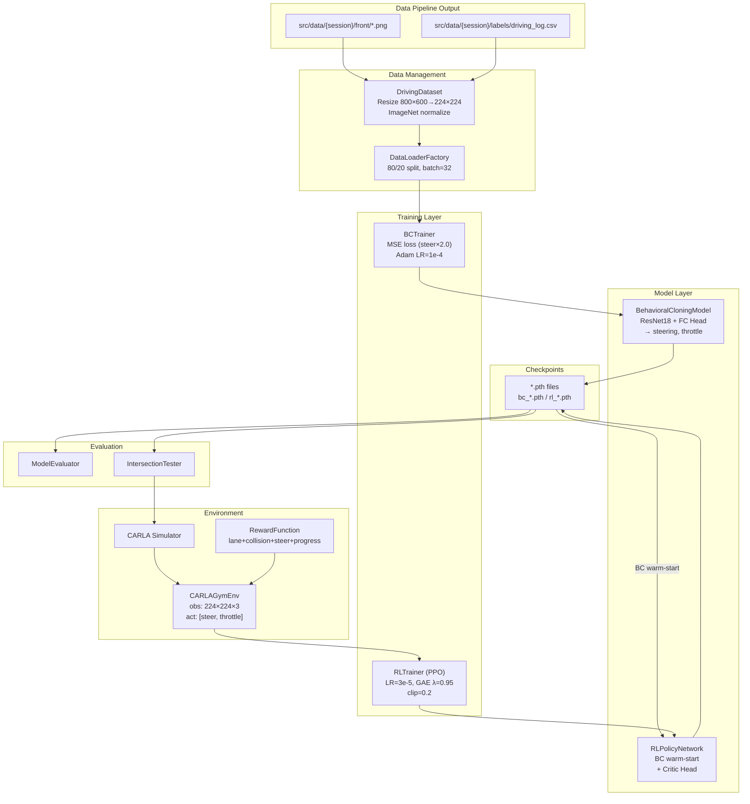

# Design Document: Experiment & ML Modeling

## Overview

Experiment & ML Modeling 시스템은 두 가지 ML 접근법으로 자율주행 제어를 구현한다: Behavioral Cloning(BC)과 Deep Reinforcement Learning(RL). PyTorch 기반으로 WSL2 Linux 환경에서 동작하며, NVIDIA RTX 3090 Ti / 4090 GPU를 활용한다.

핵심 설계 원칙:
- **BC → RL 2단계**: BC로 초기 정책 확보 후, 동일 ResNet18 backbone을 warm-start하여 PPO RL 미세조정
- **경량 아키텍처**: ResNet18 + 224×224 입력 — Jetson 30Hz 추론 전제
- **Front RGB Only**: BC/RL 학습에는 전방 카메라만 사용. AVM 데이터는 Phase 3+ BEV 연구용
- **데이터 경로**: `src/data/{session}/front/` (이미지) + `src/data/{session}/labels/driving_log.csv` (라벨)
- **모듈 분리**: 데이터 로딩, 모델, 학습, 환경, 평가를 독립 모듈로 구성

## Architecture

### System Components

1. **Data Management Layer**
   - DrivingDataset: Front RGB 이미지 + 라벨 로드, 리사이즈(224×224), 정규화
   - DataLoaderFactory: train/val 분할, 셔플, 배치 구성

2. **Model Layer**
   - BehavioralCloningModel: ResNet18 backbone + FC Head (steering, throttle)
   - RLPolicyNetwork: BC 모델 warm-start + Critic Head 추가 (Actor-Critic)

3. **Training Layer**
   - BCTrainer: MSE loss (steering×2.0), Adam, early stopping
   - RLTrainer: PPO 학습 루프, BC warm-start, GAE

4. **Environment Layer**
   - CARLAGymEnv: Gymnasium 래퍼, 224×224 observation, 랜덤 날씨
   - RewardFunction: 4-component 가중합 보상

5. **Evaluation Layer**
   - ModelEvaluator: MAE, 충돌 수, 차선 거리, 생존 시간
   - IntersectionTester: 교차로 통과 테스트

### Component Interactions



### Data Flow

**BC 학습 흐름:**
1. DrivingDataset이 `src/data/{session}/front/` 이미지와 `driving_log.csv` 로드
2. 이미지를 800×600 → 224×224로 리사이즈, ImageNet mean/std로 정규화
3. 80/20 train/val 분할, batch size 32
4. BCTrainer가 BehavioralCloningModel에 배치 투입
5. MSE loss 계산 (steering×2.0 + throttle×1.0)
6. Adam optimizer로 가중치 업데이트 (LR 1e-4, ReduceLROnPlateau)
7. Phase 1: backbone frozen (10 epoch) → Phase 2: full fine-tune
8. Early stopping (patience=10), best val_loss 기준 체크포인트 저장

**RL 학습 흐름 (BC → RL 전환):**
1. BC 체크포인트 로드 (best val_loss)
2. BC의 FC Head를 Actor Head로 재사용
3. Critic Head 신규 추가: 512 → 256 (ReLU) → 1
4. CARLAGymEnv에서 에피소드 수행 (224×224 observation)
5. RewardFunction으로 보상 계산 (4-component)
6. PPO로 정책 업데이트 (LR 3e-5, GAE λ=0.95, clip=0.2)
7. Backbone frozen 100 에피소드 → 이후 full fine-tune (LR 1e-5)
8. 3,000~5,000 에피소드 학습

**추론 흐름:**
1. 체크포인트에서 모델 로드
2. CARLA에서 전방 카메라 이미지 수신
3. 224×224 리사이즈 + 정규화
4. Forward pass (< 100ms)
5. steering, throttle 추출 → CARLA 차량 제어 적용

## Components and Interfaces

### BehavioralCloningModel

**아키텍처:**
```
Input: Front RGB (800×600×3) → Resize to 224×224×3
    ↓
ResNet18 (ImageNet pretrained, conv layers)
    → Feature vector (512-d)
    ↓
FC Head
    → FC1: 512 → 256 (ReLU + Dropout 0.5)
    → FC2: 256 → 128 (ReLU + Dropout 0.3)
    → FC3: 128 → 2
    ↓
Output Heads
    → steering: tanh → [-1, 1]
    → throttle: sigmoid → [0, 1]
```

**Interface:**
```python
class BehavioralCloningModel(nn.Module):
    def __init__(self, pretrained: bool = True):
        """ResNet18 backbone + FC Head 초기화."""

    def forward(self, image: torch.Tensor) -> Tuple[torch.Tensor, torch.Tensor]:
        """
        Args:
            image: (batch, 3, 224, 224) 정규화된 텐서
        Returns:
            steering: (batch, 1) in [-1, 1]
            throttle: (batch, 1) in [0, 1]
        """

    def freeze_backbone(self):
        """ResNet18 conv layers를 frozen 상태로 설정."""

    def unfreeze_backbone(self):
        """ResNet18 conv layers를 학습 가능 상태로 전환."""
```

### RLPolicyNetwork

**아키텍처 (BC warm-start):**
```
Input: Front RGB 224×224×3
    ↓
ResNet18 Backbone (BC에서 가져온 pretrained weights)
    → Feature vector (512-d)
    ↓
┌─────────────────────────────────────┐
│ Actor Head (BC FC Head 재사용)       │
│   FC1: 512 → 256 (ReLU)            │
│   FC2: 256 → 128 (ReLU)            │
│   FC3: 128 → 2                      │
│   → steering: tanh [-1, 1]          │
│   → throttle: sigmoid [0, 1]        │
└─────────────────────────────────────┘
┌─────────────────────────────────────┐
│ Critic Head (신규 추가)              │
│   FC1: 512 → 256 (ReLU)            │
│   FC2: 256 → 1 (state value)       │
└─────────────────────────────────────┘
```

**Interface:**
```python
class RLPolicyNetwork(nn.Module):
    def __init__(self):
        """Actor-Critic 네트워크 초기화."""

    @classmethod
    def from_bc_checkpoint(cls, bc_checkpoint_path: str) -> 'RLPolicyNetwork':
        """
        BC 체크포인트에서 warm-start로 RL 네트워크 생성.
        - ResNet18 backbone weights 복사
        - Actor Head = BC FC Head weights 복사
        - Critic Head = 신규 초기화
        """

    def forward(self, state: torch.Tensor) -> Tuple[torch.Tensor, torch.Tensor, torch.Tensor]:
        """
        Args:
            state: (batch, 3, 224, 224)
        Returns:
            steering: (batch, 1) in [-1, 1]
            throttle: (batch, 1) in [0, 1]
            value: (batch, 1) state value
        """

    def get_action(self, state: torch.Tensor, deterministic: bool = False) -> Tuple[np.ndarray, np.ndarray]:
        """정책에서 action 샘플링 (deterministic=True면 mean action 반환)."""

    def freeze_backbone(self):
        """Backbone frozen (초기 100 에피소드용)."""

    def unfreeze_backbone(self):
        """Backbone 학습 가능 전환."""
```

### CARLAGymEnv

**Interface:**
```python
class CARLAGymEnv(gym.Env):
    def __init__(self, host: str = 'localhost', port: int = 2000,
                 town: str = 'Town03'):
        """
        observation_space = Box(0, 255, shape=(224, 224, 3), dtype=uint8)
        action_space = Box([-1.0, 0.0], [1.0, 1.0], dtype=float32)
        """

    def reset(self) -> np.ndarray:
        """랜덤 spawn point + 랜덤 날씨로 에피소드 초기화. 224×224 이미지 반환."""

    def step(self, action: np.ndarray) -> Tuple[np.ndarray, float, bool, dict]:
        """
        action: [steering, throttle]
        Returns: (obs_224x224, reward, done, info)
        done 조건: 충돌 / 차선 이탈 3m / 타임아웃 1000 steps
        info: {lane_distance, collision, velocity, heading_error, location, episode_step}
        """

    def close(self):
        """CARLA 연결 정리."""
```

### RewardFunction

**수식:**
```
R(s, a, s') = w_lane × (-|d_lane|)
            + w_collision × (-100 if collision else 0)
            + w_steering × (-|steer| if |steer| > 0.3 else 0)
            + w_progress × (v_forward × cos(θ_heading))

Defaults: w_lane=1.0, w_collision=1.0, w_steering=0.5, w_progress=0.1
```

**Interface:**
```python
class RewardFunction:
    def __init__(self, w_lane=1.0, w_collision=1.0, w_steering=0.5, w_progress=0.1,
                 steering_threshold=0.3):
        """가중치 설정 가능한 보상 함수."""

    def compute(self, state_info: dict, action: np.ndarray) -> float:
        """
        state_info: {lane_distance, collision, velocity, heading_error}
        action: [steering, throttle]
        Returns: scalar reward
        """
```

### DrivingDataset

**Interface:**
```python
class DrivingDataset(torch.utils.data.Dataset):
    def __init__(self, session_dir: str, transform=None):
        """
        session_dir: src/data/{YYYY-MM-DD_HHMMSS}/
        이미지: {session_dir}/front/*.png
        라벨: {session_dir}/labels/driving_log.csv
        기본 transform: Resize(224,224) + ImageNet normalize
        """

    def __len__(self) -> int: ...
    def __getitem__(self, idx) -> Tuple[torch.Tensor, torch.Tensor]:
        """
        Returns:
            image: (3, 224, 224) normalized tensor
            controls: (2,) tensor [steering, throttle]
        """
```


### DataLoaderFactory

**Interface:**
```python
class DataLoaderFactory:
    @staticmethod
    def create_dataloaders(session_dir: str, batch_size: int = 32,
                          val_split: float = 0.2, num_workers: int = 4,
                          augment: bool = True) -> Tuple[DataLoader, DataLoader]:
        """
        train/val DataLoader 생성.
        augment=True: horizontal flip (steering 부호 반전), brightness ±20%, Gaussian noise
        """
```

### BCTrainer

**Interface:**
```python
class BCTrainer:
    def __init__(self, model: BehavioralCloningModel, train_loader, val_loader,
                 lr: float = 1e-4, steering_weight: float = 2.0,
                 throttle_weight: float = 1.0):
        """Adam optimizer, MSE loss, ReduceLROnPlateau."""

    def train(self, epochs: int = 50, patience: int = 10,
              checkpoint_dir: str = 'checkpoints') -> dict:
        """
        Phase 1: backbone frozen (10 epochs) → Phase 2: full fine-tune
        Early stopping on val_loss.
        Returns: best metrics dict
        """
```

### RLTrainer

**Interface:**
```python
class RLTrainer:
    def __init__(self, policy: RLPolicyNetwork, env: CARLAGymEnv,
                 lr: float = 3e-5, gae_lambda: float = 0.95,
                 clip_ratio: float = 0.2):
        """PPO trainer with BC warm-start policy."""

    def train(self, num_episodes: int = 5000, frozen_episodes: int = 100,
              finetune_lr: float = 1e-5, checkpoint_dir: str = 'checkpoints') -> dict:
        """
        Phase 1: backbone frozen (frozen_episodes)
        Phase 2: full fine-tune (lr=finetune_lr)
        Returns: training metrics
        """
```

### CheckpointManager

**Interface:**
```python
class CheckpointManager:
    def __init__(self, checkpoint_dir: str = 'checkpoints'):
        """체크포인트 저장/로드 관리."""

    def save(self, model: nn.Module, optimizer, epoch: int,
             metrics: dict, model_type: str) -> str:
        """
        저장 형식: {model_type}_{timestamp}_epoch{N}.pth
        내용: model_type, epoch, model_state_dict, optimizer_state_dict,
              metrics, config (architecture, input_shape=(3,224,224)), timestamp
        """

    def load(self, path: str, model: nn.Module, optimizer=None) -> dict:
        """체크포인트 로드 + 무결성 검증."""

    def verify_checkpoint(self, path: str) -> bool:
        """체크포인트 파일 무결성 확인."""
```

### ModelEvaluator

**Interface:**
```python
class ModelEvaluator:
    def evaluate(self, model, test_loader=None, env=None) -> dict:
        """
        Returns: {
            mae_steering, mae_throttle,
            collision_count, avg_lane_distance,
            avg_survival_time, success_rate,
            inference_time_ms
        }
        """
```

## Data Models

### Training Data Schema

**이미지 파일:**
- 위치: `src/data/{session}/front/*.png`
- 원본: 800×600 RGB PNG
- 모델 입력: 224×224로 리사이즈 후 ImageNet 정규화

**라벨 CSV:**
- 위치: `src/data/{session}/labels/driving_log.csv`
- 스키마: `timestamp,image_filename,steering,throttle,brake,speed,location_x,location_y,location_z`

### Model Checkpoint Schema

```python
{
    'model_type': str,           # 'bc' or 'rl'
    'epoch': int,
    'model_state_dict': OrderedDict,
    'optimizer_state_dict': OrderedDict,
    'metrics': {
        'train_loss': float,
        'val_loss': float,
        'mae_steering': float,
        'mae_throttle': float,
    },
    'config': {
        'architecture': 'resnet18',
        'input_shape': (3, 224, 224),
        'learning_rate': float,
        'batch_size': int,
    },
    'timestamp': str,  # ISO format
}
```

### Gym Environment State

**Observation:** `np.ndarray` shape (224, 224, 3), dtype uint8
**Action:** `np.ndarray([steering, throttle])` shape (2,), dtype float32
**Info:**
```python
{
    'lane_distance': float,
    'collision': bool,
    'velocity': float,
    'heading_error': float,
    'location': tuple,
    'episode_step': int,
}
```

## Correctness Properties

### Property 1: Model output shape consistency

For any valid input image (batch, 3, 224, 224), BehavioralCloningModel outputs exactly two values (steering, throttle).

**Validates: Requirements 1.2, 1.3**

### Property 2: Model output range constraints

For any valid input, steering ∈ [-1.0, 1.0] and throttle ∈ [0.0, 1.0].

**Validates: Requirements 1.4, 1.5**

### Property 3: Data pairing consistency

For any dataset loaded from `src/data/{session}/front/` and `driving_log.csv`, each image is correctly paired with its steering/throttle values.

**Validates: Requirements 2.1, 2.2**

### Property 4: Checkpoint round-trip preservation

Save → Load preserves identical model weights and optimizer state.

**Validates: Requirements 10.3, 10.4**

### Property 5: Inference latency constraint

Forward pass completes within 100ms on target hardware.

**Validates: Requirements 3.2**

### Property 6: Gym step return structure

For any valid action, step() returns (obs, reward, done, info) with correct types and shapes.

**Validates: Requirements 4.5**

### Property 7: Gym observation shape

All observations have shape (224, 224, 3).

**Validates: Requirements 4.2**

### Property 8: Reward lane centering incentive

Closer to lane center → higher reward (all else equal).

**Validates: Requirements 5.2**

### Property 9: Reward collision penalty

Collision → negative reward component.

**Validates: Requirements 5.3**

### Property 10: Reward steering smoothness

|steering| > 0.3 → negative steering penalty.

**Validates: Requirements 5.4**

### Property 11: Reward scalar output

RewardFunction always returns a single float.

**Validates: Requirements 5.1**

### Property 12: BC→RL warm-start weight preservation

After from_bc_checkpoint(), backbone and actor head weights match the BC checkpoint exactly.

**Validates: Requirements 6.2**

### Property 13: Image normalization range

After preprocessing, all values are within ImageNet-normalized range.

**Validates: Requirements 9.2**

### Property 14: Dataset split completeness

Train + val = total samples, val ≈ 20%.

**Validates: Requirements 9.4**

### Property 15: Checkpoint filename format

Filename contains model_type ('bc' or 'rl') and timestamp.

**Validates: Requirements 10.2**

### Property 16: Checkpoint content completeness

Checkpoint contains model_state_dict and optimizer_state_dict.

**Validates: Requirements 10.1**

## Error Handling

### Data Loading Errors

- **손상된 이미지**: PIL 예외 catch → 스킵 + 경고 로그
- **누락된 이미지**: FileNotFoundError → 스킵 + 경고 로그
- **CSV 파싱 오류**: ValueError → 에러 메시지 + 중단
- **이미지-라벨 불일치**: 매칭된 샘플만 사용 + 경고 로그

### Model Checkpoint Errors

- **손상된 체크포인트**: torch.load 예외 → ValueError
- **키 누락**: 필수 키 검증 → KeyError
- **버전 불일치**: 경고 로그 (minor), 에러 (major)

### CARLA Connection Errors

- **연결 타임아웃**: 3회 재시도 (exponential backoff) → 실패 시 에러
- **연결 끊김**: 1회 재연결 시도 → 실패 시 에피소드 종료
- **스폰 실패**: 대체 spawn point 시도 → 전부 실패 시 RuntimeError

### Training Errors

- **NaN Loss**: 배치 스킵 + 에러 로그
- **GPU OOM**: 캐시 클리어 + 배치 크기 절반 → 재시도
- **Gradient Explosion**: gradient clipping (max_norm=1.0) + 경고 로그

## File Structure

```
src/model/
├── bc_model.py          ← BehavioralCloningModel (ResNet18 + FC Head)
├── bc_trainer.py        ← BCTrainer (MSE loss, Adam, early stopping)
├── rl_policy.py         ← RLPolicyNetwork (Actor-Critic, BC warm-start)
├── rl_trainer.py        ← RLTrainer (PPO)
├── carla_gym_env.py     ← CARLAGymEnv (Gymnasium wrapper)
├── reward.py            ← RewardFunction
├── dataset.py           ← DrivingDataset + DataLoaderFactory
├── checkpoint.py        ← CheckpointManager
├── evaluator.py         ← ModelEvaluator
├── inference.py         ← CARLA 실시간 추론 루프
└── __init__.py
```
