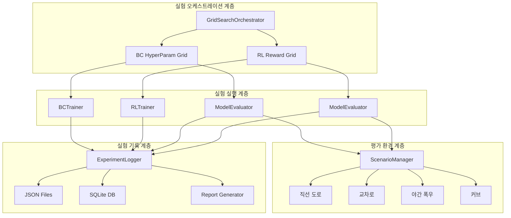

# Design Document: Experiment Validation (실험 검증)

## Overview

이 설계 문서는 CARLA 시뮬레이터 기반 자율주행 모델(BC/RL)의 체계적 실험 검증 시스템을 정의한다. 기존에 구현 완료된 `data-pipeline`(89 tests)과 `experiment-ml-modeling`(97 tests)의 코드를 실제 CARLA 환경에서 실행하여, Phase 2-A/2-B 성공 기준을 달성하기 위한 실험 인프라를 구축한다.

핵심 설계 목표 3가지:

1. **Experiment Log 아키텍처**: 실험 결과를 JSON + SQLite로 구조화 저장하여 교차 비교 가능
2. **Grid Search 자동화 래퍼**: BC 하이퍼파라미터(Req 5)와 RL Reward 튜닝(Req 9)을 야간 자동 실행
3. **통제된 CARLA 시나리오**: 고정 시드 기반 표준 평가 시나리오로 재현 가능한 성능 비교 보장

기술 환경:
- CARLA 0.9.15 (Windows Host + WSL2 Client)
- RTX 4090 × 1, RTX 3090 Ti × 1
- PyTorch 2.x, Python 3.10.12
- 2인 팀

## Architecture

### 전체 시스템 구조



### 모듈 배치

```
src/experiment/
├── __init__.py
├── experiment_logger.py      # ExperimentLogger + SQLite/JSON 저장
├── grid_search.py            # GridSearchOrchestrator
├── scenario_manager.py       # ScenarioManager (고정 시드 시나리오)
├── data_validator.py         # 데이터 품질 검증
├── analysis.py               # 실험 결과 분석 + 보정 제안
└── cli.py                    # 실험 실행 CLI 진입점
```

기존 모듈(`src/model/`, `src/data_pipeline/`)은 수정하지 않고, `src/experiment/`에서 이들을 조합하여 실험 파이프라인을 구성한다.

## Components and Interfaces

### 1. ExperimentLogger

실험 결과를 구조화하여 JSON 파일과 SQLite DB에 이중 저장한다.

```python
class ExperimentLogger:
    """실험 결과를 JSON + SQLite로 구조화 저장."""

    def __init__(self, db_path: str = "experiments/experiment_log.db",
                 json_dir: str = "experiments/logs/"):
        ...

    def create_experiment(self, experiment_type: str, purpose: str,
                          config: dict) -> str:
        """새 실험 생성, experiment_id(UUID) 반환."""
        ...

    def log_metrics(self, experiment_id: str, metrics: dict) -> None:
        """메트릭 기록 (mae_steering, mae_throttle, reward 등)."""
        ...

    def log_analysis(self, experiment_id: str, analysis: str,
                     recommendations: list[str]) -> None:
        """분석 결과 및 보정 권고 기록."""
        ...

    def log_cli_command(self, experiment_id: str, command: str) -> None:
        """재현용 CLI 명령어 기록."""
        ...

    def compare_experiments(self, experiment_ids: list[str]) -> dict:
        """여러 실험의 메트릭을 교차 비교."""
        ...

    def generate_report(self, experiment_ids: list[str] | None = None) -> str:
        """종합 보고서 생성 (Markdown)."""
        ...

    def get_experiment(self, experiment_id: str) -> dict:
        """단일 실험 조회."""
        ...

    def list_experiments(self, experiment_type: str | None = None) -> list[dict]:
        """실험 목록 조회 (타입별 필터링)."""
        ...
```

### 2. GridSearchOrchestrator

하이퍼파라미터 조합을 자동으로 순회하며 학습 + 평가를 수행한다.

```python
class GridSearchOrchestrator:
    """하이퍼파라미터 그리드 서치 자동화."""

    def __init__(self, logger: ExperimentLogger,
                 checkpoint_dir: str = "checkpoints",
                 device: str = "cuda"):
        ...

    def run_bc_grid_search(self, data_path: str,
                           param_grid: dict) -> list[str]:
        """BC 하이퍼파라미터 그리드 서치 실행.

        param_grid 예시:
        {
            "lr": [5e-5, 1e-4, 3e-4],
            "batch_size": [16, 32, 64],
            "steering_weight": [1.5, 2.0, 3.0]
        }

        Returns: 각 조합의 experiment_id 리스트
        """
        ...

    def run_rl_reward_grid_search(self, bc_checkpoint: str,
                                   reward_grid: dict,
                                   carla_host: str = "localhost") -> list[str]:
        """RL Reward 가중치 그리드 서치 실행.

        reward_grid 예시:
        {
            "w_progress": [0.1, 0.3, 0.5],
            "w_collision": [0.5, 1.0, 2.0],
            "w_steering": [0.3, 0.5, 1.0]
        }

        Returns: 각 조합의 experiment_id 리스트
        """
        ...

    def _generate_combinations(self, param_grid: dict) -> list[dict]:
        """파라미터 그리드에서 모든 조합 생성."""
        ...
```

### 3. ScenarioManager

고정 시드 기반 표준 평가 시나리오를 관리한다.

```python
@dataclass
class EvalScenario:
    """평가 시나리오 정의."""
    scenario_id: str          # e.g. "straight_clear_day"
    road_type: str            # "straight", "intersection", "curve"
    weather: str              # CARLA WeatherParameters 이름
    time_of_day: float        # sun_altitude_angle
    spawn_point_index: int    # 고정 스폰 포인트
    seed: int                 # 난수 시드
    max_steps: int            # 최대 스텝
    description: str          # 사람이 읽을 수 있는 설명


class ScenarioManager:
    """통제된 CARLA 평가 시나리오 관리."""

    STANDARD_SCENARIOS: list[EvalScenario]  # 사전 정의된 표준 시나리오

    def __init__(self, carla_host: str = "localhost",
                 carla_port: int = 2000):
        ...

    def get_scenario(self, scenario_id: str) -> EvalScenario:
        """ID로 시나리오 조회."""
        ...

    def list_scenarios(self, road_type: str | None = None) -> list[EvalScenario]:
        """시나리오 목록 (도로 유형별 필터링)."""
        ...

    def apply_scenario(self, env: CARLAGymEnv,
                       scenario: EvalScenario) -> None:
        """시나리오 설정을 CARLA 환경에 적용 (날씨, 시드, 스폰 등)."""
        ...

    def run_evaluation(self, model, scenario: EvalScenario,
                       num_runs: int = 10) -> dict:
        """특정 시나리오에서 모델 평가 실행."""
        ...

    def run_full_evaluation(self, model,
                            scenario_ids: list[str] | None = None,
                            num_runs: int = 10) -> dict:
        """전체 표준 시나리오 평가 실행."""
        ...
```

### 4. DataValidator

수집된 데이터의 품질을 정량적으로 검증한다.

```python
class DataValidator:
    """데이터 품질 검증."""

    def __init__(self, logger: ExperimentLogger):
        ...

    def validate_session(self, session_dir: str) -> dict:
        """세션 디렉토리의 데이터 품질 전체 검증.

        Returns:
            {
                "total_frames": int,
                "valid_frames": int,
                "corrupted_frames": int,
                "out_of_range_records": int,
                "timing_anomalies": int,
                "steering_distribution": dict,
                "throttle_distribution": dict,
                "needs_recollection": bool,
                "warnings": list[str]
            }
        """
        ...

    def validate_images(self, session_dir: str) -> dict:
        """이미지 무결성 검사."""
        ...

    def validate_labels(self, session_dir: str) -> dict:
        """레이블 범위 및 타이밍 검증."""
        ...

    def analyze_distribution(self, session_dir: str) -> dict:
        """steering/throttle 분포 분석."""
        ...
```

### 5. ExperimentAnalyzer

실험 결과를 분석하고 보정 조치를 제안한다.

```python
class ExperimentAnalyzer:
    """실험 결과 분석 및 보정 제안."""

    def __init__(self, logger: ExperimentLogger):
        ...

    def analyze_overfitting(self, history: dict) -> dict:
        """과적합 진단.

        Returns:
            {
                "overfitting_detected": bool,
                "overfitting_start_epoch": int | None,
                "severity": float,
                "recommendations": list[str]
            }
        """
        ...

    def analyze_bc_gap(self, metrics: dict, targets: dict) -> dict:
        """BC 성능과 목표 간 격차 분석 + 보정 제안."""
        ...

    def analyze_rl_improvement(self, bc_metrics: dict,
                                rl_metrics: dict) -> dict:
        """BC 대비 RL 성능 향상 분석."""
        ...

    def analyze_failure_cases(self, failure_logs: list[dict]) -> dict:
        """실패 사례 유형별 분석."""
        ...

    def generate_correction_plan(self, all_results: dict) -> dict:
        """종합 보정 계획 생성."""
        ...
```

### 6. MultiCameraPipeline

기존 단일 카메라 파이프라인을 5대 카메라로 확장한다.

```python
class MultiCameraPipeline:
    """Front RGB + AVM 4대 동시 수집 파이프라인."""

    CAMERA_CONFIGS = {
        "front": {"res": (800, 600), "fov": 90, "pos": (1.5, 0, 2.4)},
        "avm_front": {"res": (400, 300), "fov": 120, "pos": (2.0, 0, 0.5)},
        "avm_rear": {"res": (400, 300), "fov": 120, "pos": (-2.0, 0, 0.5)},
        "avm_left": {"res": (400, 300), "fov": 120, "pos": (0, -1.0, 0.5)},
        "avm_right": {"res": (400, 300), "fov": 120, "pos": (0, 1.0, 0.5)},
    }

    def __init__(self, carla_host: str = "localhost",
                 carla_port: int = 2000,
                 output_dir: str = "src/data"):
        ...

    def setup_cameras(self, vehicle) -> None:
        """5대 카메라를 차량에 부착."""
        ...

    def run(self, duration_sec: float = 3600.0) -> dict:
        """동기화된 멀티카메라 수집 실행."""
        ...

    def get_frame_drop_stats(self) -> dict[str, float]:
        """카메라별 프레임 드롭률 반환."""
        ...
```


## Data Models

### ExperimentRecord (SQLite + JSON)

```sql
-- experiments 테이블: 실험 메타데이터
CREATE TABLE experiments (
    experiment_id   TEXT PRIMARY KEY,       -- UUID
    experiment_type TEXT NOT NULL,           -- 'bc_training', 'rl_training', 'bc_inference',
                                            -- 'data_collection', 'data_validation',
                                            -- 'bc_grid_search', 'rl_reward_search',
                                            -- 'condition_optimization'
    purpose         TEXT NOT NULL,           -- 실험 목적 설명
    created_at      TEXT NOT NULL,           -- ISO 8601 타임스탬프
    status          TEXT NOT NULL DEFAULT 'running',  -- 'running', 'completed', 'failed'
    parent_id       TEXT,                    -- 그리드 서치 부모 실험 ID (NULL 가능)
    FOREIGN KEY (parent_id) REFERENCES experiments(experiment_id)
);

-- experiment_configs 테이블: 하이퍼파라미터 및 설정
CREATE TABLE experiment_configs (
    experiment_id   TEXT NOT NULL,
    config_key      TEXT NOT NULL,           -- e.g. 'lr', 'batch_size', 'w_progress'
    config_value    TEXT NOT NULL,           -- JSON-encoded 값
    PRIMARY KEY (experiment_id, config_key),
    FOREIGN KEY (experiment_id) REFERENCES experiments(experiment_id)
);

-- experiment_metrics 테이블: 결과 메트릭
CREATE TABLE experiment_metrics (
    experiment_id   TEXT NOT NULL,
    metric_key      TEXT NOT NULL,           -- e.g. 'mae_steering', 'val_loss', 'pass_rate'
    metric_value    REAL NOT NULL,
    recorded_at     TEXT NOT NULL,           -- ISO 8601
    PRIMARY KEY (experiment_id, metric_key, recorded_at),
    FOREIGN KEY (experiment_id) REFERENCES experiments(experiment_id)
);

-- experiment_analysis 테이블: 분석 및 권고
CREATE TABLE experiment_analysis (
    experiment_id   TEXT NOT NULL,
    analysis_text   TEXT NOT NULL,
    recommendations TEXT NOT NULL,           -- JSON array
    created_at      TEXT NOT NULL,
    FOREIGN KEY (experiment_id) REFERENCES experiments(experiment_id)
);

-- experiment_cli_commands 테이블: 재현용 CLI 명령어
CREATE TABLE experiment_cli_commands (
    experiment_id   TEXT NOT NULL,
    command         TEXT NOT NULL,
    FOREIGN KEY (experiment_id) REFERENCES experiments(experiment_id)
);

-- experiment_artifacts 테이블: 체크포인트, 데이터 경로 등
CREATE TABLE experiment_artifacts (
    experiment_id   TEXT NOT NULL,
    artifact_type   TEXT NOT NULL,           -- 'checkpoint', 'dataset', 'report'
    artifact_path   TEXT NOT NULL,
    FOREIGN KEY (experiment_id) REFERENCES experiments(experiment_id)
);
```

### JSON 파일 구조 (개별 실험)

```json
{
    "experiment_id": "a1b2c3d4-...",
    "experiment_type": "bc_training",
    "purpose": "BC 기본 학습 — lr=1e-4, batch=32",
    "created_at": "2026-04-01T10:30:00",
    "status": "completed",
    "config": {
        "data_path": "src/data/2026-03-19_095016",
        "lr": 1e-4,
        "batch_size": 32,
        "epochs": 50,
        "frozen_epochs": 10,
        "steering_weight": 2.0,
        "throttle_weight": 1.0,
        "augment": true
    },
    "metrics": {
        "best_val_loss": 0.0234,
        "best_epoch": 35,
        "total_epochs": 45,
        "mae_steering": 0.087,
        "mae_throttle": 0.065,
        "early_stopped": true,
        "early_stop_epoch": 45
    },
    "training_history": {
        "train_loss": [0.15, 0.12, ...],
        "val_loss": [0.14, 0.11, ...]
    },
    "analysis": {
        "text": "Phase 1→2 전환 시 val_loss 0.05→0.03 감소. 과적합 미감지.",
        "recommendations": []
    },
    "cli_command": "python -m model.train_bc --data_path src/data/2026-03-19_095016 --lr 1e-4 --batch_size 32 --epochs 50",
    "artifacts": {
        "checkpoint": "checkpoints/bc_20260401_103000_epoch35.pth",
        "dataset": "src/data/2026-03-19_095016"
    }
}
```

### EvalScenario 데이터 모델

```python
@dataclass
class EvalScenario:
    scenario_id: str          # "straight_clear_day", "intersection_rain_night" 등
    road_type: str            # "straight", "intersection", "curve"
    weather: str              # "ClearNoon", "WetCloudyNoon", "SoftRainSunset"
    time_of_day: float        # sun_altitude_angle (0=day, 90=backlight, 180=night)
    spawn_point_index: int    # 고정 스폰 포인트 인덱스
    seed: int                 # 환경 난수 시드
    max_steps: int            # 최대 스텝 (기본 1000)
    description: str          # "직선 도로, 맑은 낮"
```

### 표준 평가 시나리오 목록

| scenario_id | road_type | weather | time_of_day | seed | description |
|---|---|---|---|---|---|
| straight_clear_day | straight | ClearNoon | 0 | 42 | 직선 도로, 맑은 낮 |
| straight_rain_day | straight | WetCloudyNoon | 0 | 42 | 직선 도로, 비 오는 낮 |
| intersection_clear_day | intersection | ClearNoon | 0 | 100 | 교차로, 맑은 낮 |
| intersection_rain_night | intersection | WetCloudyNoon | 180 | 100 | 교차로, 비 오는 밤 |
| curve_clear_day | curve | ClearNoon | 0 | 200 | 커브, 맑은 낮 |
| curve_fog_night | curve | SoftRainSunset | 180 | 200 | 커브, 안개 낀 밤 |
| intersection_fog_backlight | intersection | SoftRainSunset | 90 | 300 | 교차로, 안개+역광 |

### GridSearch 파라미터 그리드

**BC 하이퍼파라미터 (Requirement 5)**:
```python
BC_PARAM_GRID = {
    "lr": [5e-5, 1e-4, 3e-4],
    "batch_size": [16, 32, 64],
    "steering_weight": [1.5, 2.0, 3.0],
}
# 총 27개 조합
```

**RL Reward 가중치 (Requirement 9)**:
```python
RL_REWARD_GRID = {
    "w_progress": [0.1, 0.3, 0.5],
    "w_collision": [0.5, 1.0, 2.0],
    "w_steering": [0.3, 0.5, 1.0],
}
# 총 27개 조합
```

### DataValidationReport 모델

```python
@dataclass
class DataValidationReport:
    session_dir: str
    total_frames: int
    valid_frames: int
    corrupted_frames: int
    out_of_range_steering: int      # [-1.0, 1.0] 범위 밖
    out_of_range_throttle: int      # [0.0, 1.0] 범위 밖
    timing_anomalies: int           # 80ms~120ms 범위 밖 간격
    frame_drop_rate: float          # 드롭률 (%)
    steering_mean: float
    steering_std: float
    throttle_mean: float
    throttle_std: float
    needs_recollection: bool        # 손상 비율 > 5%
    warnings: list[str]
```

### FailureCase 모델

```python
@dataclass
class FailureCase:
    timestamp: float
    failure_type: str               # "collision", "lane_departure", "stopped"
    image_path: str | None          # 종료 시점 이미지 경로
    steering_pred: float
    throttle_pred: float
    lane_distance: float
    velocity: float
    scenario_id: str
```


## Correctness Properties

*A property is a characteristic or behavior that should hold true across all valid executions of a system — essentially, a formal statement about what the system should do. Properties serve as the bridge between human-readable specifications and machine-verifiable correctness guarantees.*

### Property 1: 분포 분석 정확성

*For any* steering 값 배열과 throttle 값 배열이 주어졌을 때, `analyze_distribution` 함수가 반환하는 mean, std, histogram bin counts의 합은 입력 배열의 길이와 동일해야 하며, mean은 numpy.mean과 일치해야 한다.

**Validates: Requirements 1.4**

### Property 2: 이미지 무결성 검증

*For any* 유효한 PNG 이미지 바이트와 임의의 손상된 바이트(0바이트 파일, 잘린 파일, 비-PNG 데이터)가 주어졌을 때, `validate_images` 함수는 유효한 이미지를 valid로, 손상된 이미지를 corrupted로 정확히 분류해야 한다.

**Validates: Requirements 2.1**

### Property 3: 레이블 범위 및 타이밍 검증

*For any* steering 값, throttle 값, 타임스탬프 시퀀스가 주어졌을 때, `validate_labels` 함수는 steering이 [-1.0, 1.0] 범위 밖인 레코드 수, throttle이 [0.0, 1.0] 범위 밖인 레코드 수, 연속 프레임 간 간격이 80ms~120ms 범위 밖인 횟수를 정확히 계산해야 한다.

**Validates: Requirements 2.2, 2.3**

### Property 4: 검증 보고서 완전성

*For any* DataValidationReport가 생성될 때, 보고서는 반드시 total_frames, valid_frames, corrupted_frames, out_of_range_records, timing_anomalies 필드를 모두 포함해야 하며, valid_frames + corrupted_frames ≤ total_frames 이어야 한다.

**Validates: Requirements 2.4**

### Property 5: 실험 기록 완전성

*For any* 실험 유형(bc_training, rl_training, bc_inference, rl_reward_search 등)과 해당 유형의 임의의 메트릭 딕셔너리가 주어졌을 때, `ExperimentLogger.create_experiment` + `log_metrics`를 호출한 후 `get_experiment`로 조회하면, 기록된 데이터에 experiment_id, created_at, config, metrics의 모든 키가 보존되어야 한다.

**Validates: Requirements 3.4, 5.2, 6.5, 8.3, 9.2, 12.1**

### Property 6: 실험 기록 라운드트립

*For any* 유효한 실험 데이터(config dict, metrics dict)가 주어졌을 때, ExperimentLogger에 JSON으로 저장한 후 다시 로드하면 원본 데이터와 동일해야 한다. 마찬가지로 SQLite에 저장한 후 조회하면 동일한 값이 반환되어야 한다.

**Validates: Requirements 12.1, 12.2**

### Property 7: 과적합 분석

*For any* train_loss가 단조 감소하고 val_loss가 특정 에포크 이후 3 에포크 연속 상승하는 시계열이 주어졌을 때, `analyze_overfitting` 함수는 overfitting_detected=True를 반환하고, overfitting_start_epoch은 val_loss가 상승하기 시작한 에포크와 일치해야 하며, recommendations 리스트는 비어있지 않아야 한다.

**Validates: Requirements 4.1, 4.2**

### Property 8: 실험 비교

*For any* 두 개 이상의 실험 결과(각각 동일한 메트릭 키를 가진 dict)가 주어졌을 때, `compare_experiments` 함수는 각 메트릭에 대해 두 실험 간의 차이(delta)를 계산하고, 개선 여부(improved boolean)를 올바르게 판정해야 한다.

**Validates: Requirements 4.3, 10.4, 13.3**

### Property 9: 그리드 조합 생성

*For any* 파라미터 그리드(각 키에 대해 1개 이상의 값 리스트)가 주어졌을 때, `_generate_combinations` 함수가 반환하는 조합의 수는 각 값 리스트 길이의 곱과 동일해야 하며, 모든 조합은 고유해야 하고, 각 조합은 그리드의 모든 키를 포함해야 한다.

**Validates: Requirements 5.1, 9.1**

### Property 10: 그리드 서치 결과 분석 및 목표 판정

*For any* 그리드 서치 결과 목록(각 결과에 mae_steering, mae_throttle 또는 avg_reward, avg_speed 포함)과 목표값이 주어졌을 때, 분석 함수는 목표 달성 조합과 미달성 조합을 정확히 분류해야 하며, 미달성 시 recommendations 리스트는 비어있지 않아야 한다.

**Validates: Requirements 5.3, 9.3**

### Property 11: 실패 사례 기록 완전성

*For any* FailureCase 데이터(failure_type, steering_pred, throttle_pred, lane_distance, velocity 포함)가 주어졌을 때, 기록 후 조회하면 모든 필드가 보존되어야 한다.

**Validates: Requirements 7.1**

### Property 12: 실패 유형 집계 및 권고

*For any* FailureCase 목록이 주어졌을 때, `analyze_failure_cases` 함수는 각 failure_type별 빈도를 정확히 집계해야 하며, 빈도의 합은 입력 목록의 길이와 동일해야 하고, 각 실패 유형에 대해 최소 1개의 recommendation을 포함해야 한다.

**Validates: Requirements 7.2, 7.3**

### Property 13: 수렴 추세 감지

*For any* reward 시계열이 주어졌을 때, 지정된 윈도우(예: 500 에피소드) 이후 이동 평균이 단조 비증가이면 `analyze_convergence` 함수는 converging=False를 반환해야 하며, 이동 평균이 단조 증가이면 converging=True를 반환해야 한다.

**Validates: Requirements 8.5**

### Property 14: 멀티카메라 타임스탬프 동기화

*For any* 멀티카메라 수집 프레임 세트에서, 동일 틱에 수집된 5대 카메라의 타임스탬프는 모두 동일해야 한다.

**Validates: Requirements 11.2**

### Property 15: CLI 명령어 재현성

*For any* 실험 설정(experiment_type, config dict)이 주어졌을 때, `log_cli_command`로 기록된 CLI 명령어를 파싱하면 원본 config의 모든 하이퍼파라미터 값이 명령어 인자에 포함되어야 한다.

**Validates: Requirements 12.2**

### Property 16: 종합 보고서 시간순 정렬

*For any* 임의의 순서로 생성된 실험 목록이 주어졌을 때, `generate_report` 함수가 생성하는 보고서 내 실험 항목들은 created_at 기준 오름차순으로 정렬되어야 한다.

**Validates: Requirements 12.3**

### Property 17: Phase 성공 기준 종합 판정

*For any* 메트릭 세트(mae_steering, mae_throttle, intersection_pass_rate, survival_time)가 주어졌을 때, 판정 함수는 모든 메트릭이 목표를 충족할 때만 phase_passed=True를 반환해야 하며, 하나라도 미충족이면 phase_passed=False와 함께 미충족 항목 목록을 반환해야 한다.

**Validates: Requirements 12.4**

### Property 18: 격차 분석 및 보정 제안

*For any* 달성된 메트릭 값과 목표 메트릭 값이 주어졌을 때, 격차가 존재하면(달성값이 목표에 미달하면) 분석 함수는 최소 1개의 보정 조치를 제안해야 하며, 격차가 없으면 빈 recommendations를 반환해야 한다.

**Validates: Requirements 10.1, 10.2, 10.3**


## Error Handling

### CARLA 연결 오류
- CARLA 서버 미실행 또는 연결 실패 시 `ConnectionError`를 발생시키고, 실험을 `failed` 상태로 기록
- GridSearchOrchestrator는 개별 조합 실패 시 해당 조합만 `failed`로 표시하고 나머지 조합 계속 실행
- 최대 3회 재시도 후 실패 처리

### 학습 중 오류
- NaN loss 발생 시 해당 배치 스킵 (기존 BCTrainer/RLTrainer 동작 유지)
- GPU OOM 발생 시 batch_size를 절반으로 줄여 재시도하는 로직을 GridSearchOrchestrator에 구현
- 학습 중 예외 발생 시 현재까지의 체크포인트와 메트릭을 보존하고 실험을 `failed`로 기록

### 데이터 검증 오류
- 세션 디렉토리 미존재 시 `FileNotFoundError` 발생
- driving_log.csv 파싱 실패 시 `ValueError` 발생 및 상세 오류 메시지 포함
- 손상 비율 > 5% 시 `needs_recollection=True` 플래그 설정 및 경고 로그

### ExperimentLogger 오류
- SQLite DB 접근 실패 시 JSON 파일만으로 fallback 저장
- JSON 직렬화 실패 시 (예: numpy 타입) 자동 변환 후 재시도
- 동시 접근 시 SQLite의 WAL 모드 활용으로 충돌 방지

### ScenarioManager 오류
- 존재하지 않는 scenario_id 요청 시 `KeyError` 발생
- 스폰 포인트 인덱스가 맵의 범위를 초과하면 가장 가까운 유효 스폰 포인트로 fallback
- 날씨 프리셋 적용 실패 시 기본값(ClearNoon) 사용 및 경고 로그

### 그리드 서치 오류
- 빈 파라미터 그리드 입력 시 `ValueError` 발생
- 전체 조합 중 50% 이상 실패 시 그리드 서치를 중단하고 부분 결과 반환
- 각 조합의 실행 결과(성공/실패)를 개별적으로 기록

## Testing Strategy

### 테스트 프레임워크
- **단위 테스트**: pytest
- **Property-Based 테스트**: Hypothesis (Python)
- 기존 프로젝트에서 이미 Hypothesis를 사용 중 (`.hypothesis/` 디렉토리 존재)

### 단위 테스트 (pytest)

단위 테스트는 구체적인 예시, 엣지 케이스, 에러 조건에 집중한다.

- ExperimentLogger: DB 생성, 실험 CRUD, 빈 DB 조회
- DataValidator: 빈 세션 디렉토리, CSV 없는 경우, 모든 이미지 손상된 경우
- ScenarioManager: 존재하지 않는 시나리오 ID, 빈 시나리오 목록
- GridSearchOrchestrator: 빈 그리드, 단일 파라미터 그리드
- ExperimentAnalyzer: 과적합 없는 시계열, 모든 목표 달성 케이스
- 엣지 케이스: 손상 비율 정확히 5% (경계값), 평균 속도 정확히 1.0 m/s, 교차로 통과율 정확히 50%

### Property-Based 테스트 (Hypothesis)

각 correctness property를 Hypothesis의 `@given` 데코레이터로 구현한다.
최소 100회 반복 실행하며, 각 테스트에 설계 문서의 property 번호를 태그한다.

태그 형식: `# Feature: experiment-validation, Property {N}: {property_text}`

Property 테스트 목록:
1. 분포 분석 정확성 — 임의의 float 배열 생성, numpy 결과와 비교
2. 이미지 무결성 검증 — 임의의 유효/손상 바이트 생성, 분류 정확성 검증
3. 레이블 범위 및 타이밍 검증 — 임의의 값/타임스탬프 생성, 범위 밖 카운트 검증
4. 검증 보고서 완전성 — 임의의 검증 결과로 보고서 생성, 필수 필드 존재 확인
5. 실험 기록 완전성 — 임의의 실험 데이터 저장/조회, 필드 보존 확인
6. 실험 기록 라운드트립 — JSON/SQLite 저장 후 로드, 동일성 확인
7. 과적합 분석 — 과적합 패턴의 시계열 생성, 감지 정확성 확인
8. 실험 비교 — 임의의 두 메트릭 세트 비교, delta 및 improved 정확성 확인
9. 그리드 조합 생성 — 임의의 파라미터 그리드, 조합 수 = 값 리스트 길이의 곱
10. 그리드 서치 결과 분석 — 임의의 결과 + 목표, 달성/미달성 분류 정확성
11. 실패 사례 기록 완전성 — 임의의 FailureCase 저장/조회, 필드 보존
12. 실패 유형 집계 및 권고 — 임의의 실패 목록, 빈도 합 = 목록 길이
13. 수렴 추세 감지 — 단조 증가/비증가 시계열, converging 판정 정확성
14. 멀티카메라 타임스탬프 동기화 — 동일 틱의 5개 타임스탬프 동일성
15. CLI 명령어 재현성 — 임의의 config, 명령어 파싱 후 값 포함 확인
16. 종합 보고서 시간순 정렬 — 임의 순서 실험, 보고서 내 시간순 정렬 확인
17. Phase 성공 기준 종합 판정 — 임의의 메트릭, 모두 충족 시만 passed=True
18. 격차 분석 및 보정 제안 — 격차 존재 시 recommendations 비어있지 않음

### 테스트 파일 구조

```
tests/experiment/
├── __init__.py
├── test_experiment_logger.py           # 단위 + Property 5, 6
├── test_experiment_logger_properties.py # Property 5, 6 전용
├── test_data_validator.py              # 단위 + Property 2, 3, 4
├── test_data_validator_properties.py   # Property 1, 2, 3, 4 전용
├── test_grid_search.py                 # 단위 + Property 9
├── test_grid_search_properties.py      # Property 9, 10 전용
├── test_scenario_manager.py            # 단위 + Property 14
├── test_analysis.py                    # 단위 + Property 7, 8, 12, 13, 17, 18
├── test_analysis_properties.py         # Property 7, 8, 10, 12, 13, 17, 18 전용
├── test_report_properties.py           # Property 15, 16 전용
└── test_failure_cases.py               # 단위 + Property 11, 12
```

### Hypothesis 설정

```python
from hypothesis import settings

# 모든 property 테스트에 적용
@settings(max_examples=100, deadline=None)
```

`deadline=None`은 CARLA 관련 테스트가 아닌 순수 로직 테스트에서도 타임아웃을 방지하기 위함이다. 실제 CARLA 통합 테스트는 property 테스트 범위에 포함하지 않는다.
