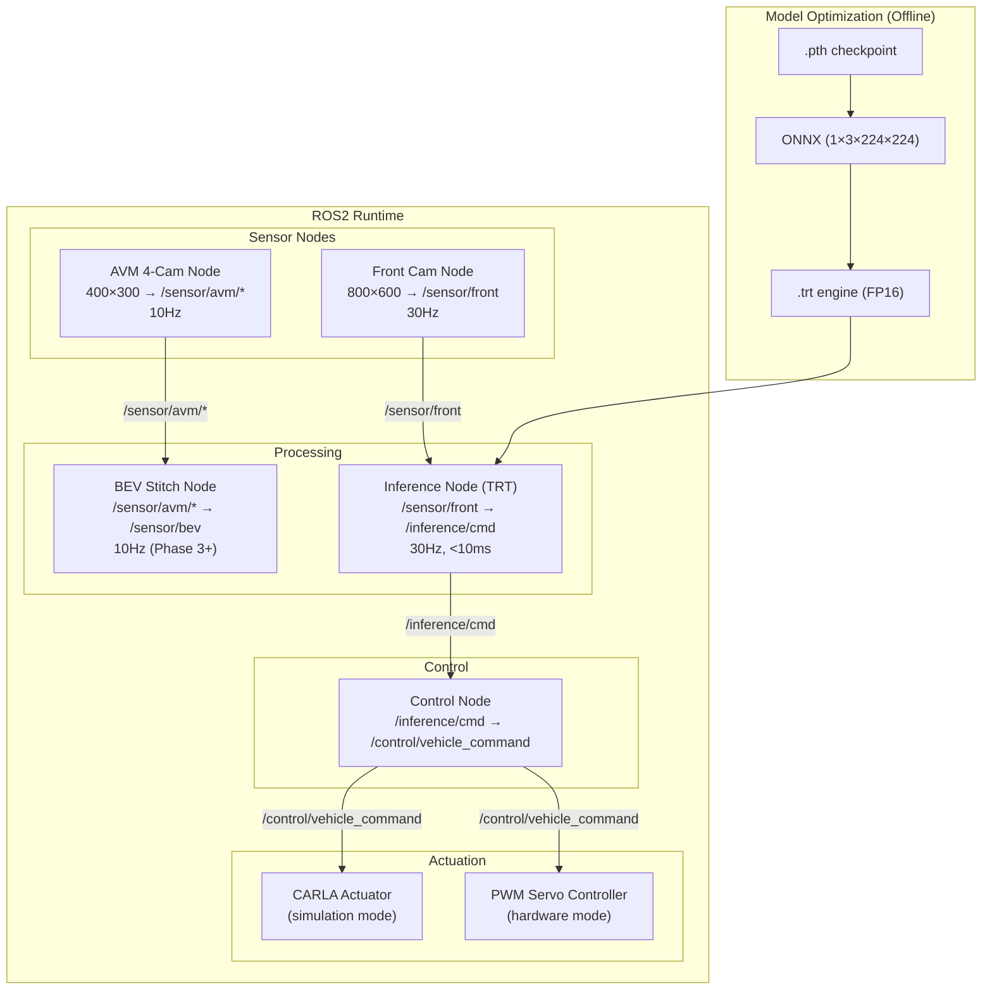

# Design Document: Productization

## Overview

Productization 시스템은 실험 단계의 자율주행 코드를 프로덕션 수준 ROS2 시스템으로 변환한다. 멀티카메라(5대) 지원, TensorRT 양자화(FP16 우선), PWM 서보 제어를 통해 RC카(Jetson) 실차 배포를 달성한다.

핵심 설계 원칙:
- **모듈 분리**: 센서, 추론, 제어를 독립 ROS2 노드로 분리
- **멀티카메라**: Front RGB(30Hz) + AVM 4대(10Hz), BEV 스티칭은 Phase 3+
- **성능 최적화**: FP16 TensorRT → Jetson에서 <10ms 추론
- **PWM 제어**: CAN 대신 PWM 서보/ESC로 RC카 직접 구동
- **듀얼 모드**: simulation(CARLA) / hardware(실차) 전환

배포 플랫폼:
- Edge: NVIDIA Jetson Xavier NX / Orin Nano + TensorRT
- 미들웨어: ROS2 Humble on Ubuntu 22.04
- 모델 소스: PyTorch .pth (experiment-ml-modeling), input shape (1,3,224,224)
- 차량: 1/10 RC카, PWM 서보 + ESC

## Architecture

### System Components

1. **ROS2 Node Layer**
   - Front_Cam_Node: 전방 RGB 카메라 (800×600, 30Hz) → `/sensor/front`
   - AVM_Cam_Node: AVM 4대 카메라 (400×300, 10Hz) → `/sensor/avm/*`
   - BEV_Stitch_Node: AVM 스티칭 → `/sensor/bev` (Phase 3+)
   - Inference_Node: TensorRT 추론 → `/inference/cmd`
   - Control_Node: 제어 명령 집계 → `/control/vehicle_command`

2. **Model Optimization Pipeline**
   - PyTorch Loader → ONNX Exporter → TensorRT Builder (FP16 우선)
   - 선택적 INT8 양자화 (캘리브레이션 500장)

3. **Hardware Abstraction Layer**
   - Sensor Interface: CARLA / 실제 카메라 통합
   - Actuator Interface: CARLA / PWM 서보 통합
   - Mode Manager: simulation / hardware 전환

4. **PWM Servo Controller**
   - Steering: [-1, 1] → PWM 1000~2000μs
   - Throttle: [0, 1] → ESC PWM 1000~2000μs

5. **Monitoring & Logging**
   - Performance Monitor: 지연, 주파수, 리소스 추적
   - Logger: 구조화 로깅 + 로테이션 (100MB)

### Component Interactions



### Data Flow

**Model Optimization (Offline):**
1. PyTorch .pth 로드 (experiment-ml-modeling)
2. ONNX export (opset 13, input: 1×3×224×224)
3. trtexec --fp16 → TensorRT FP16 엔진
4. 정확도 검증 (PyTorch 대비 < 5%)
5. (선택) INT8 시도: 캘리브레이션 500장 → 검증 → 오차 > 5%면 FP16 유지

**Runtime (Phase 2 Active Path):**
```
Front Cam Node → /sensor/front (800×600, 30Hz)
    → Inference Node: resize 224×224 → TensorRT (<10ms) → steering, throttle
        → /inference/cmd (30Hz)
            → Control Node → /control/vehicle_command
                → CARLA (sim) 또는 PWM Servo (hw)
```

**Runtime (Phase 3+ Full Path):**
```
위 경로 + AVM 4-Cam Node → /sensor/avm/* (10Hz)
    → BEV Stitch Node → /sensor/bev (10Hz)
        → (Future: BEV Free-Space Inference)
```

## Components and Interfaces

### Front_Cam_Node

```python
class FrontCamNode(Node):
    def __init__(self, mode: str = 'simulation'):
        """
        /sensor/front 토픽으로 800×600 RGB 이미지 발행 (30Hz).
        mode: 'simulation' (CARLA) or 'hardware' (USB/CSI camera)
        """
    def camera_callback(self, image_data): ...
```

Config: carla_host, carla_port, camera_device, frame_rate=30, width=800, height=600

### AVM_Cam_Node

```python
class AVMCamNode(Node):
    def __init__(self, mode: str = 'simulation'):
        """
        /sensor/avm/{front,rear,left,right} 토픽으로 400×300 이미지 발행 (10Hz).
        4대 카메라 동시 관리.
        """
```

Config: 4대 카메라 위치/FOV, frame_rate=10, width=400, height=300

### BEV_Stitch_Node

```python
class BEVStitchNode(Node):
    def __init__(self):
        """
        /sensor/avm/* 구독 → 호모그래피 스티칭 → /sensor/bev 발행 (10Hz).
        Phase 3+ 활성화. 기본 비활성.
        """
```

### Inference_Node

```python
class InferenceNode(Node):
    def __init__(self, engine_path: str):
        """
        /sensor/front 구독 → 224×224 리사이즈 → TensorRT 추론 (<10ms)
        → /inference/cmd 발행 (steering + throttle)
        """
    def preprocess_image(self, image: np.ndarray) -> np.ndarray:
        """800×600 → 224×224, normalize, reshape to (1,3,224,224)"""
    def inference_callback(self, msg): ...
    def monitor_gpu_memory(self): ...
```

### Control_Node

```python
class ControlNode(Node):
    def __init__(self):
        """
        /inference/cmd 구독 → /control/vehicle_command 발행.
        30Hz 주파수 모니터링 + 로깅.
        """
```

### PWM_Servo_Controller

```python
class PWMServoController(Node):
    def __init__(self, steering_pin: int, throttle_pin: int):
        """
        /control/vehicle_command 구독 → PWM 신호 출력.
        steering [-1, 1] → 1000~2000μs (center=1500μs)
        throttle [0, 1] → 1000~2000μs (neutral=1500μs)
        """
    def convert_to_pwm(self, value: float, min_us=1000, max_us=2000) -> int:
        """값을 PWM 펄스 폭(μs)으로 변환."""
    def command_callback(self, msg): ...
```

### Model_Quantizer

```python
class ModelQuantizer:
    def __init__(self, pytorch_checkpoint: str, output_path: str):
        """PyTorch → ONNX → TensorRT 변환 파이프라인."""

    def export_to_onnx(self, model, onnx_path: str):
        """ONNX export, input shape (1, 3, 224, 224), opset 13."""

    def build_trt_engine(self, onnx_path: str, precision: str = 'fp16'):
        """TensorRT 엔진 빌드. precision: 'fp16' or 'int8'."""

    def validate_engine(self, engine, validation_data) -> float:
        """PyTorch 대비 오차(%) 계산. 5% 초과 시 ValueError."""

    def convert(self, precision: str = 'fp16') -> str:
        """
        전체 파이프라인: load → ONNX → TRT → validate → save.
        FP16 우선. INT8은 선택적 (calibration 500장 필요).
        """
```

### Performance Monitor

```python
class PerformanceMonitor:
    def __init__(self, target_frequency: float = 30.0):
        """지연, 주파수, 리소스 모니터링."""
    def record_latency(self, component: str, latency_ms: float): ...
    def record_frequency(self, frequency_hz: float): ...
    def check_thresholds(self): ...
```

## Data Models

### ROS2 Message Definitions

**CameraImage.msg:**
```
std_msgs/Header header
uint32 height
uint32 width
string encoding  # rgb8
uint8[] data
```

**SteeringCommand.msg:**
```
std_msgs/Header header
float32 steering   # [-1.0, 1.0]
float32 throttle   # [0.0, 1.0]
float32 confidence # [0.0, 1.0]
```

**VehicleCommand.msg:**
```
std_msgs/Header header
float32 steering   # [-1.0, 1.0]
float32 throttle   # [0.0, 1.0]
```

### TensorRT Engine Metadata

- Input shape: (1, 3, 224, 224)
- Output shape: (1, 2) [steering, throttle]
- Precision: FP16 (기본) or INT8 (선택)
- Target: NVIDIA Jetson Xavier NX / Orin Nano

### 양자화 성능 목표

| 메트릭 | FP32 (PyTorch) | FP16 (TensorRT) | INT8 (TensorRT) |
|--------|:-:|:-:|:-:|
| 추론 지연 | ~15ms (4090) | ~5ms (Jetson) | ~3ms (Jetson) |
| 정확도 오차 | baseline | < 2% | < 5% |
| 모델 크기 | ~45MB | ~23MB | ~12MB |

### Configuration Schema

```yaml
mode: simulation  # 'simulation' or 'hardware'

sensor:
  front:
    frame_rate: 30
    width: 800
    height: 600
  avm:
    frame_rate: 10
    width: 400
    height: 300
    cameras: [front, rear, left, right]
  bev_stitch:
    enabled: false  # Phase 3+ 활성화

inference:
  engine_path: /path/to/model.trt
  inference_timeout_ms: 10
  gpu_memory_threshold: 0.8

control:
  target_frequency: 30.0

pwm_servo:  # hardware mode only
  steering_pin: 18
  throttle_pin: 19
  steering_center_us: 1500
  throttle_neutral_us: 1500

logging:
  log_dir: /var/log/productization
  max_file_size_mb: 100
```

### ROS2 Topic Map

| 토픽 | 발행 노드 | 구독 노드 | 주기 | Phase |
|------|----------|----------|------|-------|
| /sensor/front | Front_Cam_Node | Inference_Node | 30Hz | 2 |
| /sensor/avm/front | AVM_Cam_Node | BEV_Stitch_Node | 10Hz | 3+ |
| /sensor/avm/rear | AVM_Cam_Node | BEV_Stitch_Node | 10Hz | 3+ |
| /sensor/avm/left | AVM_Cam_Node | BEV_Stitch_Node | 10Hz | 3+ |
| /sensor/avm/right | AVM_Cam_Node | BEV_Stitch_Node | 10Hz | 3+ |
| /sensor/bev | BEV_Stitch_Node | (Future) | 10Hz | 3+ |
| /inference/cmd | Inference_Node | Control_Node | 30Hz | 2 |
| /control/vehicle_command | Control_Node | PWM/CARLA | 30Hz | 2 |


### RC카 하드웨어 구성

| 항목 | 사양 | 비고 |
|------|------|------|
| 컴퓨팅 | NVIDIA Jetson Xavier NX / Orin Nano | TensorRT 지원 |
| 전방 카메라 | USB 또는 CSI (800×600) | 주행 제어용 1대 |
| AVM 카메라 | 광각 × 4 (400×300, FOV 120°) | 전/후/좌/우, BEV용 |
| 차체 | 1/10 스케일 RC카 | 조향 서보 + ESC |
| 제어 | ROS2 → PWM 변환 | servo_node |

### Package Structure

```
src/deploy/
├── sensor_node/
│   ├── front_cam_node.py      ← Front RGB (30Hz)
│   ├── avm_cam_node.py        ← AVM 4대 (10Hz)
│   └── bev_stitch_node.py     ← BEV 스티칭 (Phase 3+)
├── inference_node/
│   ├── inference_node.py      ← TensorRT 추론
│   ├── trt_runtime.py         ← TRT 엔진 래퍼
│   └── preprocessor.py        ← 224×224 리사이즈 + 정규화
├── control_node/
│   ├── control_node.py        ← 제어 명령 집계
│   └── frequency_monitor.py   ← 주파수 모니터링
├── servo_node/
│   └── pwm_servo_controller.py ← PWM 서보/ESC 제어
├── quantizer/
│   └── model_quantizer.py     ← PyTorch → ONNX → TRT
└── common/
    ├── performance_monitor.py
    └── logger.py
```

## Correctness Properties

### Property 1: ROS2 message delivery latency
Any message → delivered to subscribers within 10ms.
**Validates: Requirements 1.7**

### Property 2: Model conversion pipeline completeness
Any valid .pth checkpoint → successful FP16 TensorRT conversion.
**Validates: Requirements 3.1, 8.1, 8.2, 8.3**

### Property 3: Quantization precision fallback
INT8 error > 5% → automatic FP16 fallback.
**Validates: Requirements 3.5**

### Property 4: TensorRT engine validation
Any TensorRT engine → output within 5% error vs PyTorch.
**Validates: Requirements 3.2, 8.4**

### Property 5: Inference latency reduction
TensorRT engine → ≥50% latency reduction vs FP32.
**Validates: Requirements 3.6**

### Property 6: Real-time inference latency
Any /sensor/front image → inference < 10ms on Jetson.
**Validates: Requirements 4.2**

### Property 7: Control frequency maintenance
Continuous operation → ≥ 30Hz control frequency.
**Validates: Requirements 5.1**

### Property 8: End-to-end pipeline latency
Sensor publish → control publish < 33ms.
**Validates: Requirements 5.2**

### Property 9: PWM conversion accuracy
steering [-1, 1] → PWM 1000~2000μs, linear mapping.
**Validates: Requirements 6.2, 6.3**

### Property 10: Multi-camera topic consistency
Front Cam → /sensor/front (30Hz), AVM → /sensor/avm/* (10Hz).
**Validates: Requirements 1.2, 1.3**

## Error Handling

### Model Quantization Errors
- **체크포인트 로드 실패**: 에러 로그 + exit code 2
- **ONNX export 실패**: 에러 로그 + exit code 2
- **TensorRT 빌드 실패**: 에러 로그 + exit code 2
- **캘리브레이션 데이터 부족**: < 500장 → 에러 + 중단
- **검증 오차 초과**: INT8 > 5% → FP16 fallback

### ROS2 Node Errors
- **TRT 엔진 로드 실패**: exit code 1
- **토픽 연결 타임아웃**: 10초 후 경고, 재시도 계속
- **GPU OOM**: 캐시 클리어 + 재시도 1회 → 실패 시 종료
- **추론 타임아웃**: > 10ms → 경고 로그 (non-fatal)

### PWM Servo Errors
- **PWM 출력 실패**: 에러 로그, 계속 실행
- **잘못된 값 범위**: 클램핑 + 경고 로그

### CARLA Connection Errors
- **연결 타임아웃**: 3회 재시도 → 실패 시 종료
- **연결 끊김**: 1회 재연결 → 실패 시 degraded mode

### Performance Degradation
- **제어 주파수 하락**: < 30Hz 100ms 이상 → 경고 로그
- **GPU 메모리 초과**: > 80% → 경고 로그

## Testing Strategy

### Unit Testing (pytest)
```
tests/deploy/
├── test_front_cam_node.py
├── test_avm_cam_node.py
├── test_inference_node.py
├── test_control_node.py
├── test_pwm_servo.py
├── test_model_quantizer.py
└── test_performance_monitor.py
```

### Property-Based Testing (Hypothesis)
- Property 1~10 각각에 대해 100+ iterations
- Custom strategies: valid_camera_images, valid_steering_commands

### Integration Testing
- ROS2 파이프라인 E2E (sensor → inference → control)
- 모델 양자화 파이프라인 (PyTorch → ONNX → TRT)
- CARLA 연동 (simulation mode)
- PWM 서보 (hardware mode, 가상 인터페이스)

### Performance Testing
- 추론 지연: 1000회 측정, p95 < 10ms (Jetson)
- 제어 주파수: 60초 연속, ≥ 30Hz 유지
- E2E 지연: p95 < 33ms
